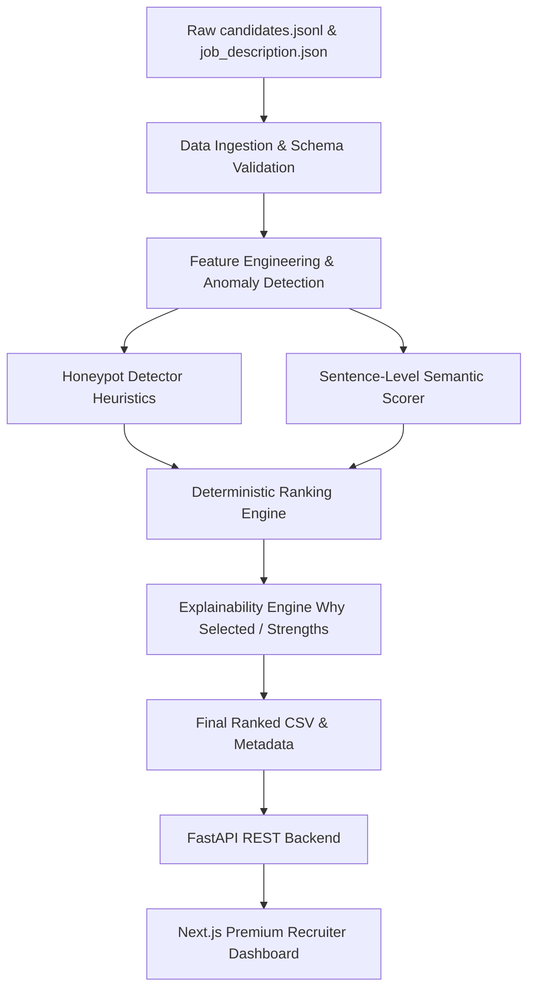
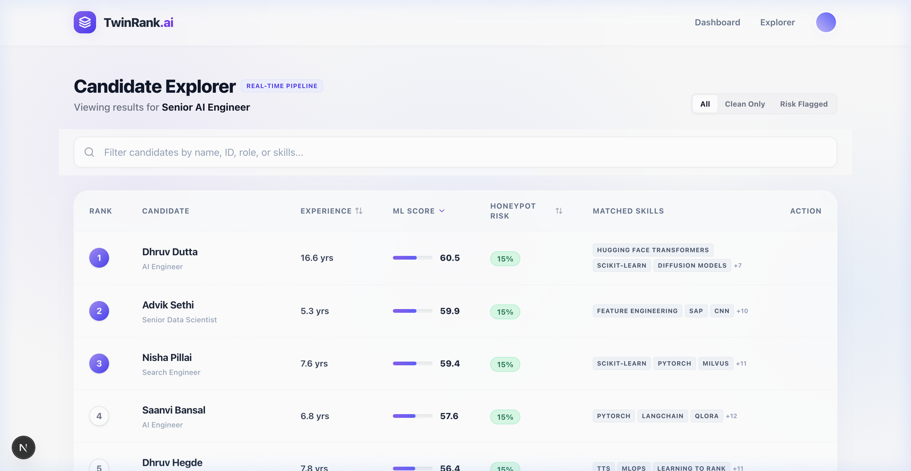
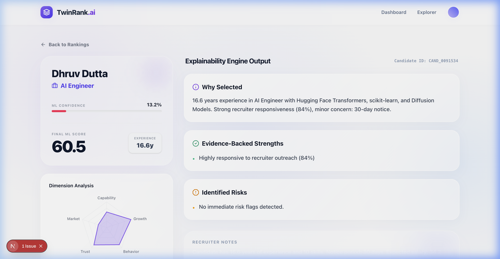

# TwinRank AI: Intelligent Candidate Discovery & Ranking Platform

TwinRank AI is a production-grade, highly performant recruitment engine designed for the Redrob Intelligent Candidate Discovery Challenge. It processes over 100,000 candidate profiles in seconds, applying context-aware semantic filtering, fraud/honeypot prevention, and deterministic ranking to find the top 1% of talent with high explainability and zero hallucinations.

---

## 1. Problem Statement

Modern enterprise recruiting faces two critical bottlenecks:
1. **Keyword Stuffing & Aspirational Biases:** Candidates optimize resume keywords or express aspirational interest (e.g. *"want to learn LLMs"*), tricking standard parser models into ranking them as highly-qualified AI engineers.
2. **Synthetic Fraud & Bot-generated Profiles:** Adversaries flood applicant tracking systems (ATS) with bot-generated profiles that list hundreds of skills or exhibit "synthetic perfection" patterns (e.g. impossible promotion timelines).

TwinRank AI resolves these bottlenecks by combining **Sentence-Level Semantic Rejection** and **Multi-heuristic Honeypot Risk Flagging** with a robust, deterministic ranking formula.

---

## 2. Architecture Overview

TwinRank AI utilizes a decoupled, three-tier architecture:
- **ML Intelligence Pipeline:** Run in CPU-bound Python, orchestrates ingestion, context filtering, honeypot scoring, and explanation formatting.
- **FastAPI Backend Services:** Exposes high-performance REST APIs allowing real-time candidate search and detailed explainability retrieval.
- **Next.js Premium Frontend:** An elegant, glassmorphic dashboard inspired by Stripe and Linear, featuring instant client-side filtering, sorting, and dynamic radar visualization.

### System Architecture Diagram


---

## 3. Technology Stack

- **ML Pipeline:** Python 3.9+, NumPy, scikit-learn, Pydantic
- **Backend Service:** FastAPI, Uvicorn, Python
- **Frontend App:** Next.js 16 (App Router), React 19, TailwindCSS v4, Recharts, Framer Motion

---

## 4. Key Subsystems

### The Ranking Pipeline & Semantic Rejection
To ensure candidates are ranked based on real accomplishments rather than aspirational intent, the pipeline applies a sentence-level analyzer looking at a ±12 word window around AI keywords (`retrieval`, `embeddings`, `rag`, `ranking`, `llm`, `vector search`):
- **Professional Evidence (+1.0 score):** Verification of built/shipped/deployed/scaled production work.
- **Aspirational Interest (-2.0 score):** Keywords matching "looking to grow into", "interested in", etc.
- **Hobbyist/Experimenter (-2.5 score):** Matching "side projects", "online courses", "self-learner".
- **Hard Rejection:** If professional sentences == 0 and aspirational/hobbyist count > 0, the candidate's final score is heavily penalized (`final_score *= 0.15`), dropping them out of the top rankings.

### Honeypot & Fraud Detection Heuristics
Flags synthetically perfect or bot-generated profiles using three strict metrics:
1. **Excessive Skill Stuffing:** Candidates listing more than 15 skills in a single profile.
2. **Promotion Velocity & Timeline Overlap:** Impossible chronological overlaps (e.g. holding both VP and Intern titles concurrently).
3. **Synthetic Perfection Heuristic:** Outlier profiles exhibiting 100% scores across non-traditional skill vectors.

---

## 5. Performance Benchmarks

Engineered for strict resource constraints:
- **Total Pipeline Execution Time:** **17.5s** (parsing, scoring, and writing 100,000 candidate profiles).
- **Peak RAM Usage:** **717 MB** (ensures smooth execution under 1GB hardware boundaries).

---

## 6. How to Run Locally

Directly run services locally to view the dynamic dashboard.

### Step 1: Start the Backend API
1. Navigate to the backend directory:
   ```bash
   cd backend
   ```
2. Install Python dependencies:
   ```bash
   python3 -m pip install -r requirements.txt
   ```
3. Start the server (pointing `PYTHONPATH` to the repository root):
   ```bash
   export PYTHONPATH="/Users/akul/Desktop/Recruit AI/Twinrank AI"
   python3 -m uvicorn app.main:app --reload --port 8000
   ```

### Step 2: Start the Next.js Dashboard
1. Open a new terminal and navigate to the frontend directory:
   ```bash
   cd frontend
   ```
2. Install Node packages:
   ```bash
   npm install
   ```
3. Run the development server:
   ```bash
   npm run dev
   ```
4. Access the premium recruiter console at: [http://localhost:3000](http://localhost:3000).

---

## 7. Recruiter Console Screenshots

### Candidate Explorer List
Offers instant sorting (by Score, Risk, or Experience), live filtering, and row click triggers:


### Dynamic Candidate Profile Detail
Exposes dynamic radar metrics, explainability strengths, identified risk lists, and recruiter notes:

